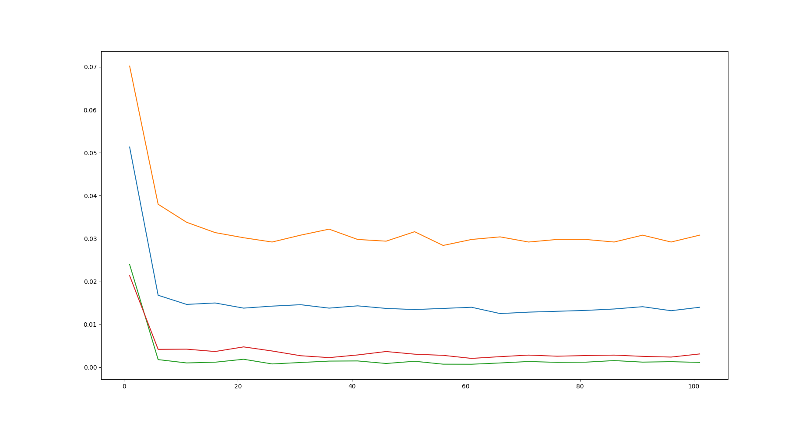

# 2
## (a)

What is the theoretical expected error?

25 percent

Use python to simulate the above classifiers. What are the resulting train and test
errors?

Trivial classifier I training error: 0.758
Trivial classifier I testing error: 0.78
Trivial classifier II training error: 0.75
Trivial classifier II testing error: 0.75

## (b)

### (i)

the minimum test error rate: 0.0284

corresponding std: 0.0028

When number of trees increases, error rate goes down.

I think it shows convergence because when number of trees increases, the test error decreases and remains low

### (ii)

#### max_features = 3

the minimum test error rate: 0.0284

corresponding std: 0.00119

When number of trees increases, error rate goes down.

I think it shows convergence because when number of trees increases, the test error decreases and remains low

#### max_features = 4

the minimum test error rate: 0.0275

corresponding std: 0.00307

When number of trees increases, error rate goes down.

I think it shows convergence because when number of trees increases, the test error decreases and remains low

### (iii)

max_features = 7

the minimum test error rate: 0.0268

corresponding std: 0.00132

The test error goes down and standard deviation is relativly smaller, however, it is hard to say RF model with max_features = 7 performs better than before because the difference on test error rate is within the standard deviation range

### (iv)

max_features = 7

n_estimators = 56

the minimum test error rate: 0.02439

corresponding std: 0.001959

The training error goes down as max depth increases.

The testing error does not vary too much.

### (iv)

The best setting:

max_features = 7

n_estimators = 56

the minimum test error rate: 0.02439

corresponding std: 0.001959

Trivial classifiers:

Trivial classifier I training error: 0.758
Trivial classifier I testing error: 0.78
Trivial classifier II training error: 0.75
Trivial classifier II testing error: 0.75

It has learned from data as testing error ot the best setting is greatly smaller than trivial classifiers.
