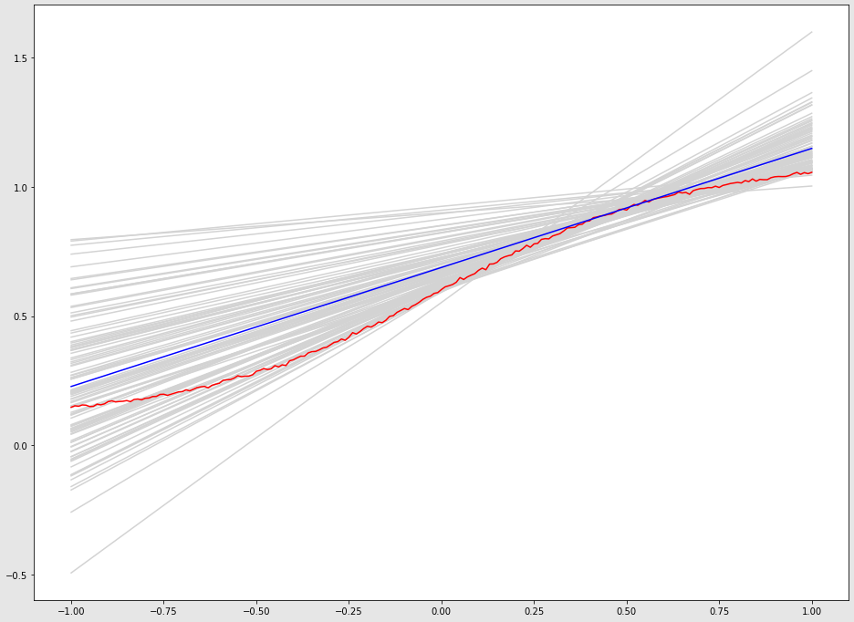

# 5

## b

a = 0.4425

b = 0.5962

## c 

bias: 0.0141

var: 0.0016

$E_D\{E_{out} (h_g ^ {(D)} \}$ = 0.0157

## d

a = 0.4473

b = 0.5914

bias: 0.01289

var: 0.001722

$E_D\{E_{out} (h_g ^ {(D)} \}$ = 0.01462

No so sensitive. Maybe because we draw many datasets and take mean value as final result.

## e

a = 0.4336

b = 0.7030

bias: 0.01617

var: 0.001703

$E_D\{E_{out} (h_g ^ {(D)} \}$ = 0.01787

The bias increases, and var decrease a little bit.