# 1

## (a)

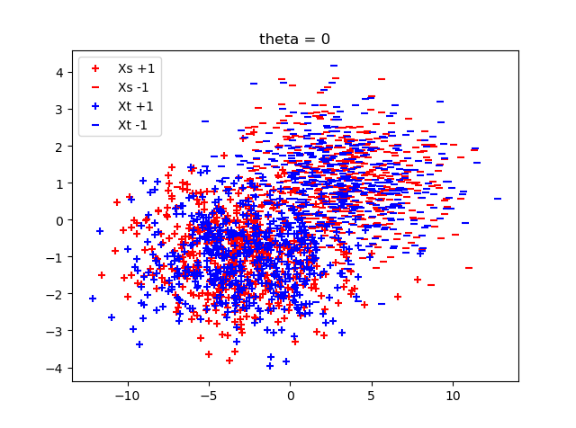
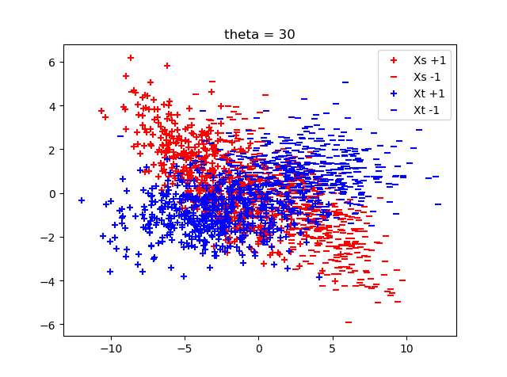
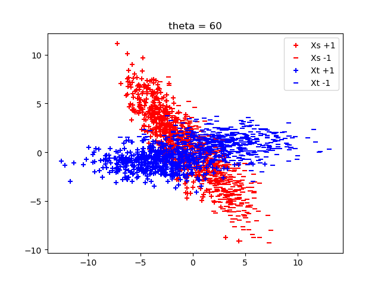
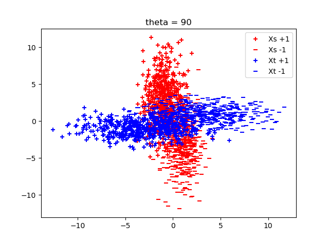
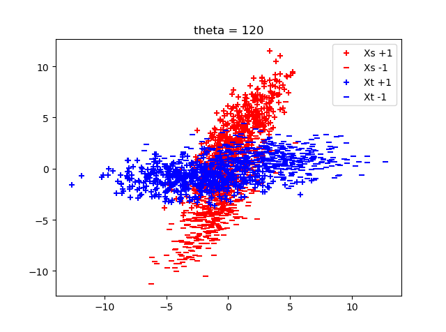
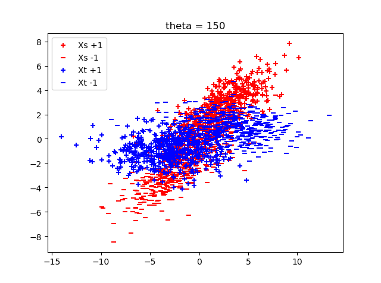
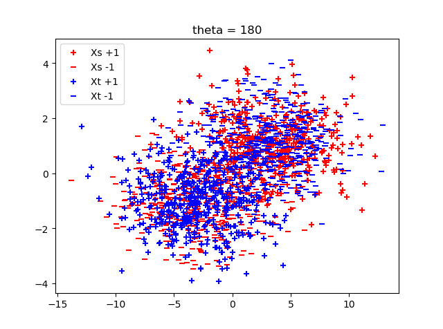

## (b)

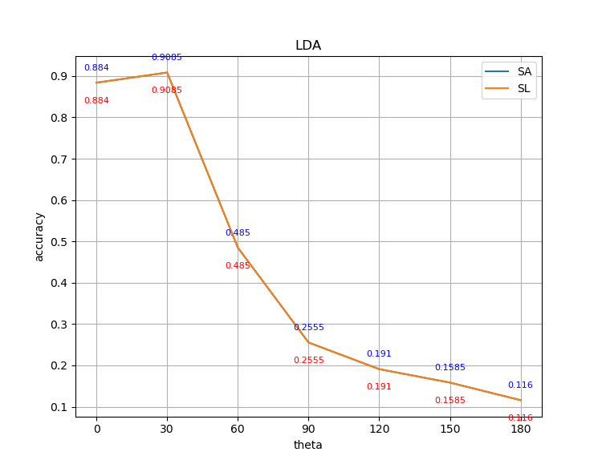

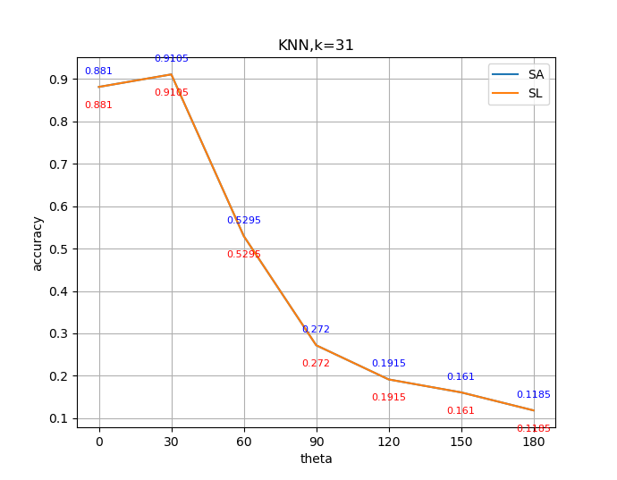

They perform the same.

## (c)

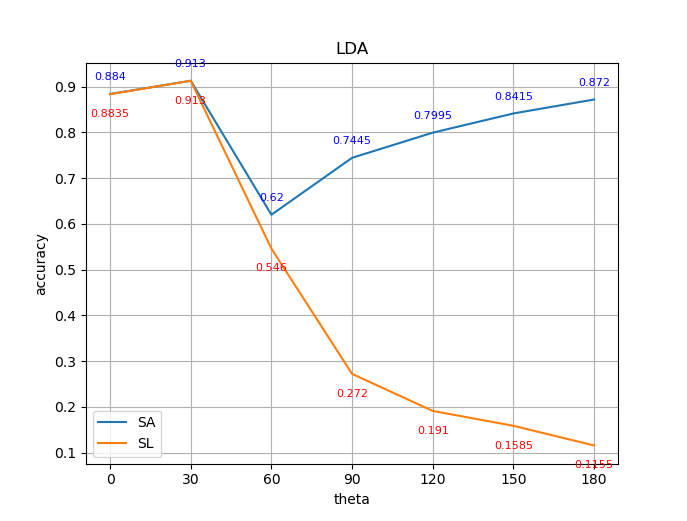
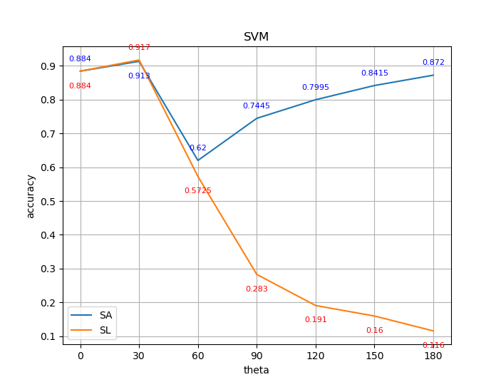
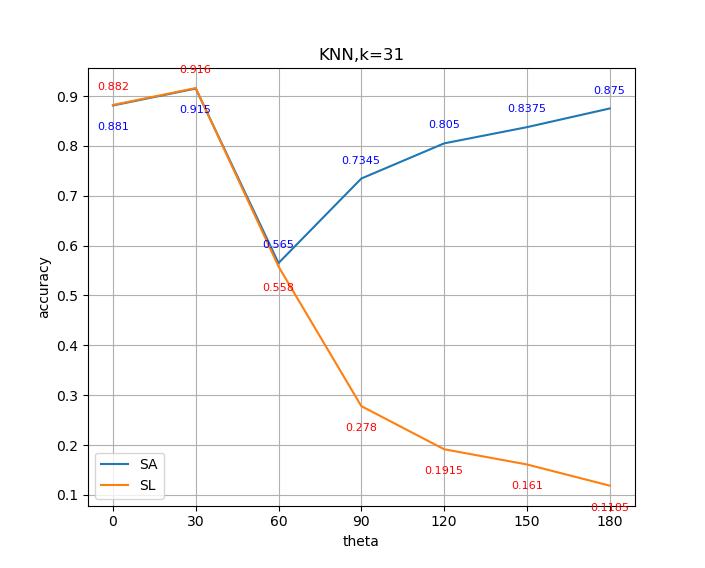

SA performs better.

Sign flipping helps improving performance of SA.

## (d)

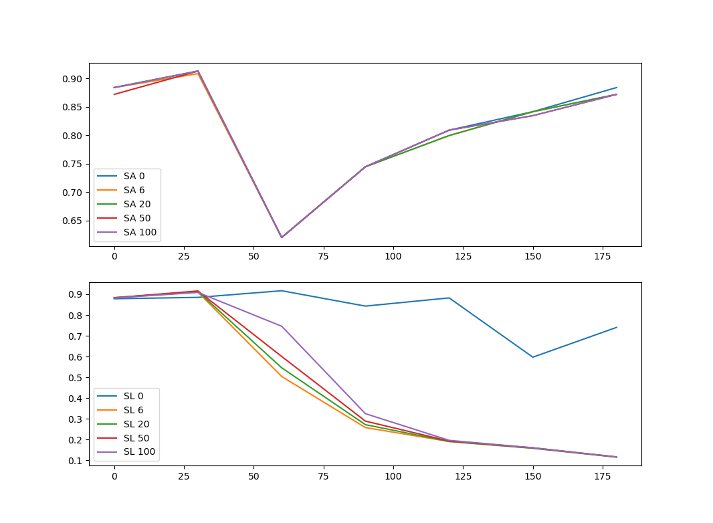

N_TL has positive effects on SA with theta is large. Maybe because target domain data can remove the ambiguity of sign of eigenvectors.

N_TL has negative effects on SL. Maybe because target domain data has no relations to source domain data and mislead classifier.

## (d)

|sign flipping|standardization|SA|SL|
|---|---|---|---|
|True|False|0.7685|0.6105|
|True|True|0.913|0.913|
|False|False|0.561|0.56|
|False|True|0.9085|0.9085|

Maybe standardization makes classifier easier to find optimal points and less affected by those relative large numbers.

# 2

## (a)

|N_T|N_S|alpha|epsilon|
|---|---|---|---|
|1|100|0.1|5.86|
|1|100|0.5|21.62|
|1|100|0.9|38.64|
|---|
|10|1000|0.1|2.25|
|10|1000|0.5|8.12|
|10|1000|0.9|14.46|
|---|
|100|10000|0.1|0.86|
|100|10000|0.5|2.94|
|100|10000|0.9|5.19|
|---|
|1000|100000|0.1|0.36|
|1000|100000|0.5|1.06|
|1000|100000|0.9|1.82|

No, it seems that epsilon does not converge.

## (b)

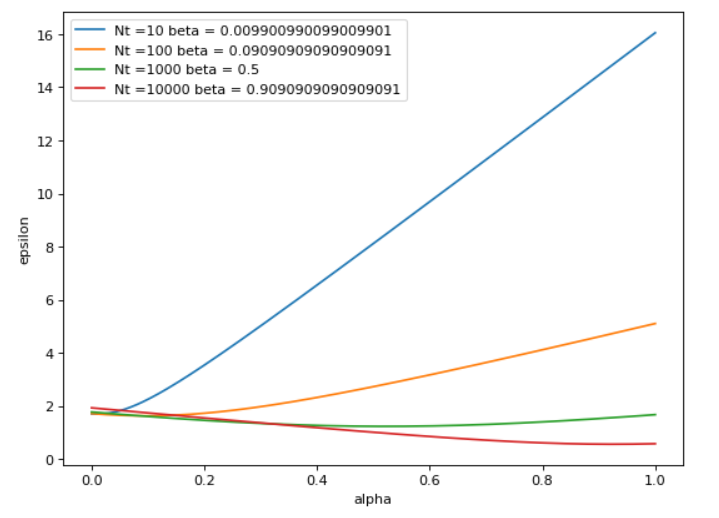

As alpha increases, the epsilon goes down first and then goes up. As N_T goes larger, the optimal value of alpha becomes larger.

## (c)

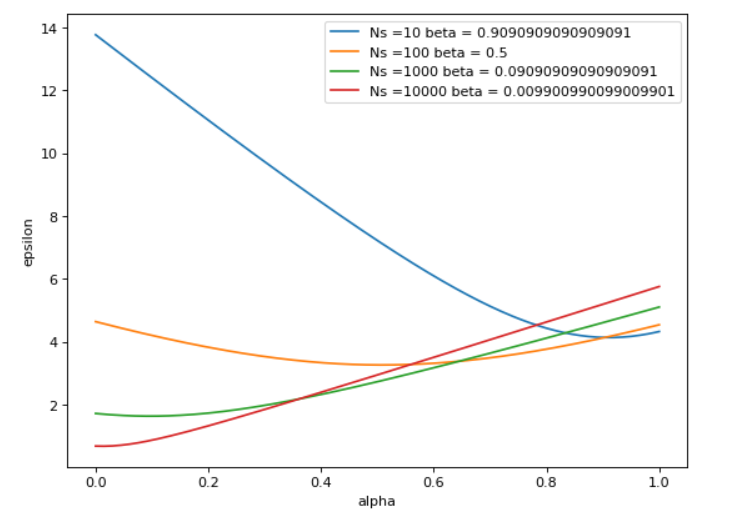

As alpha increases, the epsilon goes down first and then goes up. As N_S goes larger, the optimal value of alpha becomes smaller.

## (d)

### (iii)
alpha = 0.5
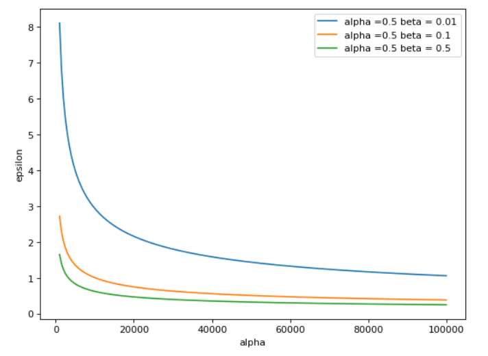

alpha = beta
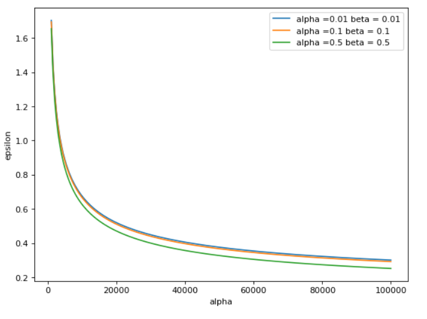

alpha = 0.5 can give a better result with less data points. With enough data points, alpha = beta performs better.

## (e)

No, it just depends on alpha beta and N.
