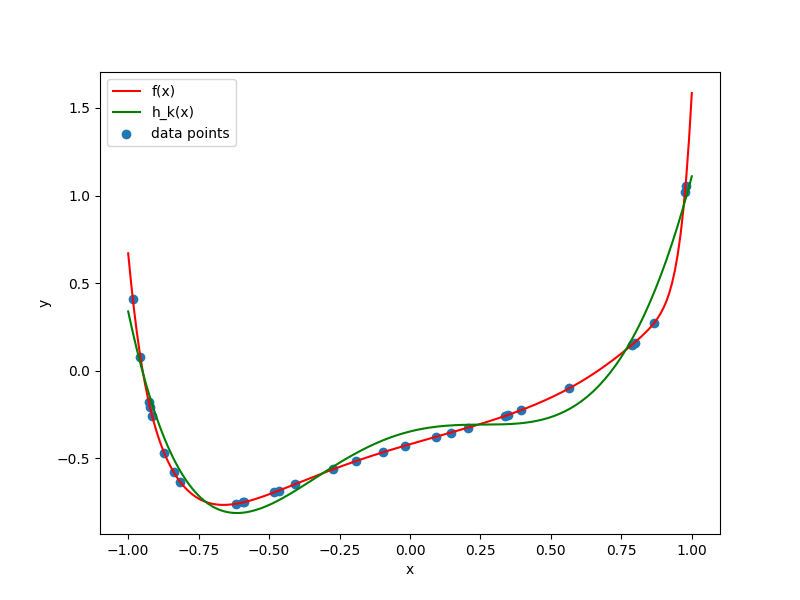

## (b)

## (c)

|k|N|E_D(E_in)|E_D(E_out)|
|---|---|---|---|
|3|10|0.008|0.2185|
|3|100|0.02666|0.03241|
|5|10|0.0005|7.1229|
|5|100|0.005101|0.0079006|
|7|10|0.00002684|1692.029|
|7|100|0.001261|0.0027701|

With the same N, 
E_D(E_in) decreases when k increases, 
as our model function becomes closer to target function; 

E_D(E_out) also decreases when k increases and N = 100 also because our model function is closer to target function, but it increases when k increases and N = 10 maybe because of overfitting.

With the same k, E_D(E_in) increases when k increases because it overfits when N = 10
and E_D(E_out) decreases when k increases because our model function is closer to target function.

## (d)

|k|N|E_D(E_in)|E_D(E_out)|
|---|---|---|---|
|3|10|0.01441|0.1745|
|3|100|0.03596|0.03275|
|5|10|0.004607|154.4132|
|5|100|0.014505|0.008554|
|7|10|0.002034|5702756.4317|
|7|100|0.01048|0.003784|

Yes, results are affected by noise. k = 7 N = 10 gets affected most. Because model is the most complicated and number of data points is small, these lead to the most overfitting.

## (e)

|alpha|0|0.00005|0.05|5|500|
|---|---|---|---|---|---|
|E_D(E_in)|0.006371|0.007066|0.008791|0.03888|0.2370
|E_D(E_out)|37.365|0.07806|0.008955|0.04796|0.2275

alpha = 0.05 leads to minimum out of sample error. It is the best.
